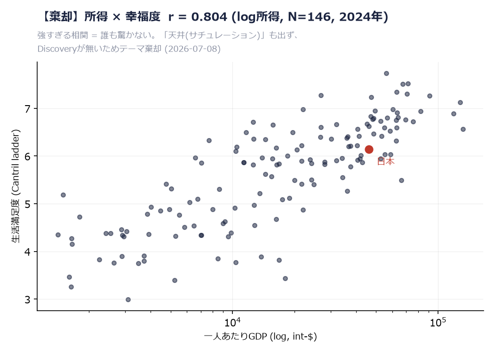
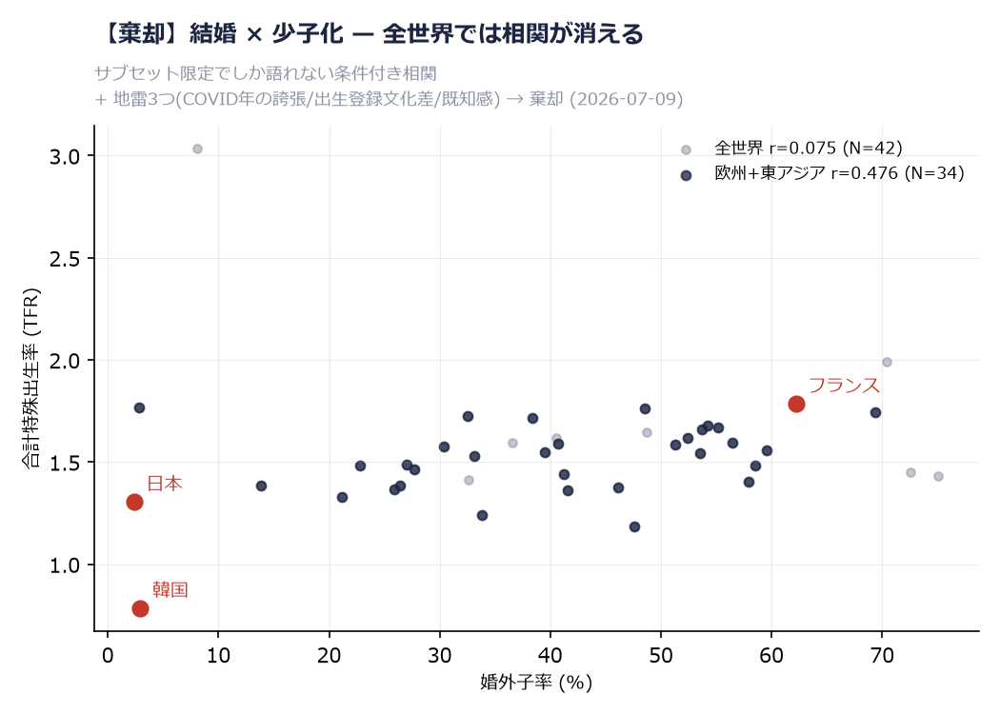
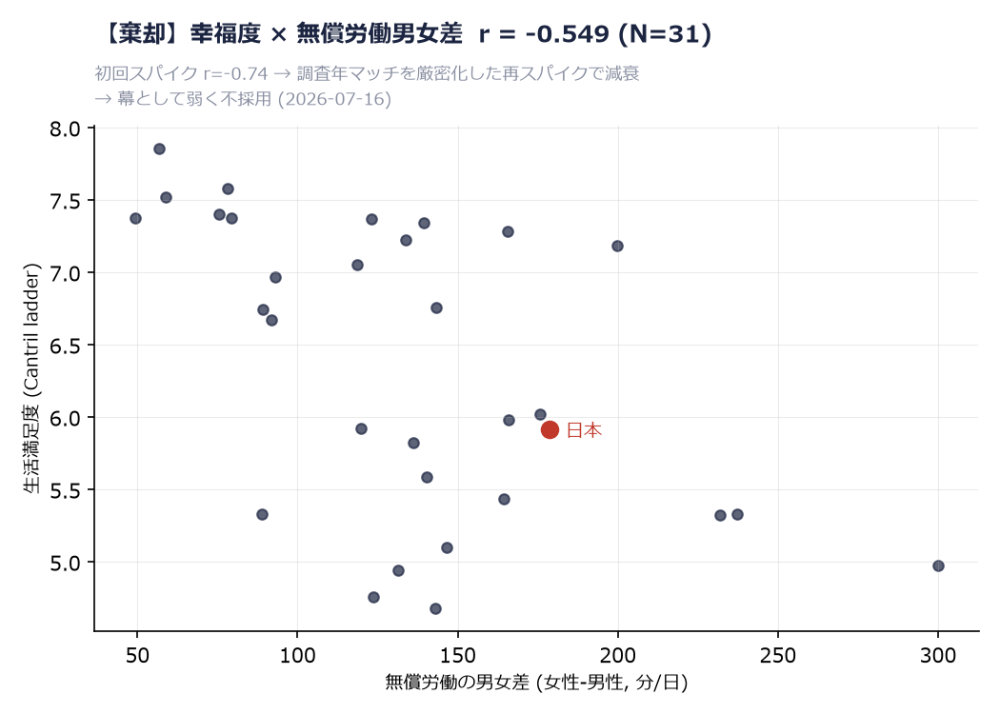
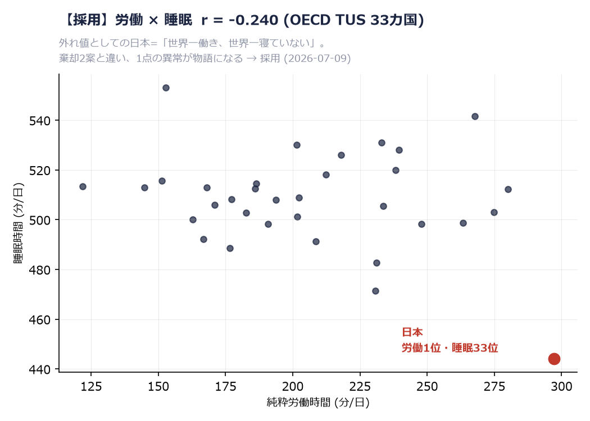

# GenAI Usage Document
## The World's Most Diligent Insomniacs — VizCon 2026

> Submitted for "Best Use of GenAI" consideration, which requires a written account of how GenAI was used in the workflow.
> It is reconstructed from the actual working records (`_progress.md`, `sources.md`, and the conversation history); nothing here is embellished.
> **Every claim below is backed by the evidence in Section 7 (reproducible rejection scatterplots, unedited excerpts of the real logs, and a before/after table).**

---

## 0. Summary — the role AI played in this piece

This piece was built by one person paired with an AI assistant (Aki, an internal Amazon agent built on Anthropic's Claude), taking it from theme selection all the way to a publish-quality bilingual scrollytelling web app. The core seven-act narrative came together in the first few days; the weeks that followed went to refinement, an evidence dossier, accessibility, and a live in-piece AI. AI was used not as "a tool that writes code," but as a **workflow partner that also carried data validation, hypothesis rejection, and quality assurance.** Three things set the approach apart:

1. **Make the AI break ideas before it builds them** — of three candidate themes, two were killed through AI-driven data validation before any building began.
2. **The AI tests its own output** — every change was verified by a headless DOM test before a human reviewed it.
3. **AI is embedded in the piece itself** — an "ask the data" concierge with a two-tier design (local computation + Groq LLM), so the piece keeps working perfectly even if the LLM goes down.

| Phase | AI's role | Human's role |
|---|---|---|
| Theme selection | Fetch candidate data, test correlations, propose rejections | Chose the "lead with the twist" angle; the editorial call to differentiate — through structure — from themes the organizers had already showcased |
| Data preparation | Generate the prep scripts, design the single-source pipeline | Validate the outputs; adjudicate the BYOD expansion (ILO / happiness / both / stay put) from the AI's comparison table |
| Fact-checking | Verify every fact; detect and correct errors | Choose which facts become the "pillars"; the final tonal call to drop exaggerations ("worst gender gap in the world") in favor of the accurate framing |
| Building | Generate the 7-act scrollytelling code; keep the two languages in sync | Feedback ("too much scrolling," "let me experience it by doing") that became the core of v2 (FLIP sort, "you" insertion); the prescription scene and the survey-year timeline were human ideas |
| Quality assurance | Design and run headless tests; root-cause bugs | Raised the audit ("could our deliverable become a backdoor?") — the XSS finding came from that instruction; final checks in real browsers and on real devices |
| In-piece AI | Build the concierge proxy (Groq connection), design the guardrail / anti-hallucination prompts | The call to ship an LLM in production; the internal approval negotiation over API-key-abuse risk; the requirement to keep it "complete even when it stops" via a local fallback |

### What the human held onto — the work that couldn't be delegated to AI

The split was not "AI builds, human checks." These four kinds of work structurally could not be handed to the AI, and the human held all of them:

1. **Direction**: the angle on the theme, the strategic decision to go for a prize, whether to adopt each data expansion (the AI recommends; the human always adjudicates).
2. **Invention**: the prescription scene (the bedtime slider), the question "I want to see change over time" (turned into the survey-year timeline that weaponizes the data's limits), and the "let me experience it by operating it" UX core.
3. **Risk and dignity**: rejecting Amazon product links, requiring the redundant design that keeps the AI "complete even when it stops," initiating the security audit, and cutting exaggerated language.
4. **Internal negotiation**: the approval process for using an external LLM (Groq) and for hosting, and the organizational coordination on public risk (API-key management).

Put the other way: moving all the time-eating work — validation, implementation, testing, multilingual sync — onto the AI let the human pour their time into those four. That concentration is the essence of this workflow.

---

## 1. Data discovery and validation — "make the AI reject"

I decided the piece's credibility would be set less by the facts I kept than by **the hypotheses I threw away.** Three candidate themes were tested with the AI against data:

- **Marriage × fertility (rejected)**: the AI computed the correlation on global data → r = 0.029 worldwide. The AI itself proposed rejection — "it only holds under conditions, and there are three political minefields." The human agreed and dropped it.
- **Income × happiness (rejected)**: the correlation between log income and happiness was 0.805 — so strong that "there's no ceiling (saturation) to reveal," i.e., weak on Discovery. The call that data too clean makes no story was also made from data.
- **Sleep × work (adopted)**: across 33 OECD Time Use countries, Japan revealed a twist — top in work *and* bottom in sleep. The overlap risk with the organizers' recommended dataset was handled by "a structure that leads with the twist."

**An example of the AI correcting its own error during fact-checking**: the first draft said "women sleep less than men in 5 of 33 countries." On re-validation while building Act 3, the AI detected and corrected it to 7 of 33. The core framing of Act 3 — "Japanese men's 40 minutes of unpaid work is itself the lowest in the world; Japanese women sleep 12 minutes less even than those men" — came out of that re-check.

**Disclosing the limits also came from AI validation**: to the idea "I want to see change over time," the AI validated the data and confirmed a time series was impossible — each country has only one point in time (scattered across 1998–2019). Instead of hiding it, we turned it into a weapon: an "About the data" note with a survey-year timeline that honestly states "this is not a photo from the same year." The definitional gap between diary-style time-use surveys and official labor statistics (under which Japan < USA) is noted the same way.

---

## 2. Data preparation — the single-source principle

- The AI generated `build_scrolly_data.py`: from a single source, `qs_country_summary.csv` (a 33-country summary), it outputs every piece of data the site uses (rankings / the 9-segment 24 hours / the by-sex splits) into a single `data.js` file.
- Zero hand-typed numbers. Because every chart and every auto-generated sentence references the same `data.js`, a data update propagates to all acts with a single regeneration command.
- Sources are recorded in one place in `sources.md` (OECD Gender Data Portal TUS / OECD SDMX / Our World in Data).

---

## 3. Building — a loop of human feedback × AI implementation

The 7-act structure (Hero / work-and-sleep rankings / the twist slope / the anatomy of 24 hours / the two extremes / the by-sex dumbbell / finale / epilogue + note) was built act by act, in a loop of **AI implements → human checks in a real browser → feedback → AI revises**:

- "Too much scrolling" → the AI compressed 6 screens to 4 and merged two rankings into one chart with a toggle + FLIP animation.
- "Let me experience it by doing" → a slider that inserts "you" into the 33-country ranking, making it personal.
- "Let me compare freely, not just against Japan" → Act 2 and the interlude were generalized to compare any two countries (rankings and auto-generated sentences recompute against the chosen country).
- Multilingual rollout: once the JA version was fixed, the AI fully synced the EN version — chart labels, auto-generated sentences, even the English regular expressions in the Q&A engine, all rewritten.

---

## 4. Quality assurance — the AI tests its own output

- **Headless DOM tests**: using happy-dom + a Node `vm`, the piece runs without a browser, and tests were designed and run for each change (18 checks for the free-comparison feature, 11 for the timeline, and so on) × 4 files. Only after confirming all PASS did it go to human review.
- **An example of disciplined root-cause analysis**: on the survey-year timeline, "the screen shakes on hover." The AI pinned the cause — swapping the caption text → the page height changes → the browser's scroll anchoring → the cursor position shifts → an endless reflow loop. After confirming a symptomatic fix (min-height) was insufficient, it moved the display into fixed-size text *inside* the SVG, zeroing out the layout shift itself.
- **AI-run security self-audit**: starting from the concern "could our deliverable become a backdoor path?", the AI audited its own code. It confirmed zero external scripts or dependencies and only two outbound destinations, then found one XSS (injection) seedling — inserting an LLM answer into the DOM — and fixed it with escaping, verifying the fix by actually injecting a malicious payload in a headless test (× 4 files).
- Every step was recorded in `_progress.md`, so the AI can fully restore context across sessions (this document could be written largely from that record).

---

## 5. In-piece AI — a two-tier "ask the data" concierge

The epilogue has an "ask the data" corner where readers ask questions in natural language. Making **the piece work perfectly even if the LLM goes down** was the top priority, so it is two-tiered:

- **Tier 1 (local, always on)**: a client-side local engine. It detects country name (JA/EN) × metric × superlative × sex as keywords and computes an answer on the spot from `data.js`. No server, no cost, permanently live. The numbers are deterministic (the same answer every time).
- **Tier 2 (LLM)**: the question goes to **Groq (llama-3.3-70b)**, which answers in natural language grounded only in the on-page data. A 6-second timeout; on failure or congestion it falls back to Tier 1 automatically.
- **A key-safe design**: the API key sits neither in the browser nor in the repository — it is held as a secret on a **serverless proxy (Val.town)**. The browser only calls the proxy's URL (CORS, rate limiting, and an input-length cap are managed proxy-side). Preventing API-key abuse was the design's top priority.
- **Containing hallucination**: the prompt specifies "ground answers only in on-page data," "label anything outside the data as general explanation," and "refuse chit-chat," so it can't invent numbers. This matters because even a 70B model, handed the raw table, mis-extracts min/max values; pre-computing the facts and forbidding the model from aggregating removed those errors.
- **Choosing the architecture (from a constraint to a solution, on my own)**: a managed LLM setup I first considered turned out not to be usable as-is under organizational guardrails. So I researched and compared lightweight serverless options that hide the API key server-side, and selected **Groq + a Val.town proxy** as meeting the safety bar for public contest exposure (no key exposure, rate limiting, input-length cap). With my manager's approval, I moved to implementation.
- **Why this design**: LLM-dependent pieces are fragile — an externally hosted AI feature can quietly go dead (a 503) long after judging, taking the whole experience down with it. So I adopted a three-layer structure — static HTML core + bolt-on AI + local fallback — engineered to keep the piece fully working even if the LLM stops.

---

## 6. Lessons — what's reproducible about this GenAI workflow

1. **Validation-driven**: make the AI break things with data before it builds. The record of rejections becomes the piece's credibility.
2. **Test-driven generation**: generated code passes the AI's own headless tests before a human sees it. Review cost drops sharply.
3. **Record-driven**: if the AI keeps writing the process into `_progress.md`, the submission document (this one) almost stands itself up at the end.
4. **Fallback design**: add in-piece AI in a form that "completes without it." The URL stays alive after judging, too.

---

## 7. Evidence — backing the claims with the real artifacts

The statements in this document can be verified against the real files in the `evidence/` folder:

### 7-1. Reproduced rejection scatterplots (`evidence/reproduce_rejections.py` + 4 figures)

The scatterplots for the two rejected themes + one rejected expansion, and for the adopted theme, can be reproduced from the same raw data by a single script. **Submitting the figures we did not use** is proof that validation-driven work actually happened.

| Figure | Decision | Reproduced value (original spike value) |
|---|---|---|
| `fig_rejected_01_money_happiness.png` | Income × happiness: correlation too strong, no Discovery → rejected | r = 0.804 (0.805), N = 146 |
| `fig_rejected_02_marriage_fertility.png` | Marriage × fertility: correlation vanishes worldwide, holds only under conditions → rejected | worldwide r = 0.075 (0.029); Europe + East Asia r = 0.476 (0.574)* |
| `fig_rejected_03_happiness_unpaidgap.png` | Happiness × unpaid-work gap: decays on re-spike → not adopted | r = −0.549 (−0.55), N = 31 |
| `fig_adopted_04_work_sleep.png` | Work × sleep: the story is not a correlation but **the single outlier that is Japan** → adopted | Japan = 297 min work (1st) / 444 min sleep (33rd) |

\* Because the country list and year-matching differ in detail from the original run, the numbers don't match exactly, but the rejection rationale — "it vanishes worldwide and only a moderate correlation surfaces on a subset" — has the same structure (the differences are noted inside the script).

### 7-2. Excerpts from the real logs (`evidence/real_log_excerpts.md`)

Seven unedited excerpts from the conversation history. The division of labor — human = decision-making (adjudicating the 4-way choice / approving designs / tonal calls), AI = validation, implementation, self-audit — is visible in unembellished logs:

1. Adjudicating the 4-way data-expansion choice (AI presents a comparison table + recommendation; the human decides)
2. Analysis of award-winner patterns (the structural rationale: "what's missing is a rebuttal act and a correlation lens")
3. Pre-implementation design confirmation (fixing the structure with the human before writing code)
4. Self-correction of a fact (killing "worst gender gap in the world" through validation, moving to an accurate and stronger framing)
5. Citation-fabrication check (verifying DOI / volume / PMID against PubMed itself)
6. XSS detection → explanation → fix → injection test
7. Discovering missing data (UK) → structurally preventing it by scripting the extraction

### 7-3. Before → After table (`evidence/Before_After.md`)

A before/after comparison of 11 AI-involved spots, with primary-record dates (from `_progress.md`).

---

### 7-4. Claim grading & reproducibility packet (`evidence/REVIEW_PACKET.md`)

Every headline claim in the public visualization, graded one by one (A–D), each with a **runnable reproduce command** and a **falsifier condition**. It is not a "we checked our work" statement: a third party can run the same commands against the shipped data (`scrolly/data.js`, 33 countries) and either confirm each number or watch a claim break. This is the same validation-driven discipline applied to the *finished* piece — the point where AI is used as an audit instrument, not an author:

- Grade A (holds): Japan sleep 444.1 min = lowest of 33; women's sleep 438 min = world-lowest; men's unpaid work 40.3 min = world-lowest; women sleep less than men in exactly 7 of 33 countries (AI's first pass said 5 — corrected to 7 against the data).
- Grade B (holds with a caveat): Japan paid work 297.1 min = highest of 33, flagged with the ILO cross-check (annual 1,654 h < US 1,789 h — the time-use "day" and the annual-hours series measure different things).
- Grade D (dropped): "world's worst gender sleep gap" (falsified — India's gap 13.5 min > Japan's 11.7), income × happiness, and marriage × fertility, all cut for being unsupportable or non-Discovery.

The grades that read "D — dropped" are the evidence: claims that failed validation never shipped.

## Appendix: Tools used
- AI assistant: Aki (an internal Amazon AI agent built on Anthropic's Claude)
- In-piece LLM: Groq — llama-3.3-70b (via the Val.town serverless proxy; the API key is held as a server-side secret)
- Testing: happy-dom + Node.js vm (headless DOM)
- Data processing: Python (pandas)
- The piece: static HTML/CSS/JS (no framework), hand-built SVG charts
